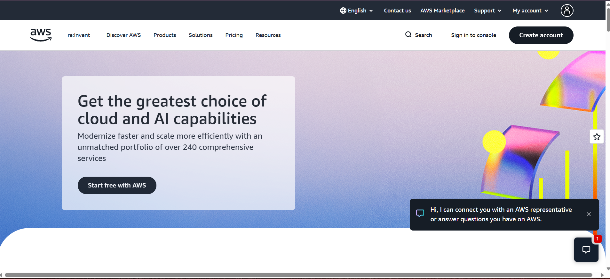

# Amazon Web Services (AWS) Research

## Brief Overview

Amazon Web Services (AWS) is a cloud computing platform developed by Amazon. It provides many services for computing, storage, databases, networking, security, analytics, artificial intelligence, and application development. AWS allows organizations to use cloud resources without having to maintain all of their own physical servers.

## Global Infrastructure

AWS has a large global infrastructure made up of Regions and Availability Zones. A Region is a geographic area containing multiple Availability Zones. Availability Zones are separate locations designed to help applications remain available even when one location experiences a problem.

## Cloud Management Console

The AWS Management Console is a web-based interface used to create, configure, monitor, and manage AWS resources. Users can access services such as EC2, S3, IAM, databases, and networking through the console.

## Four Core Services

### 1. Amazon EC2

Amazon Elastic Compute Cloud (EC2) provides virtual servers that can run applications and operating systems in the cloud.

### 2. Amazon S3

Amazon Simple Storage Service (S3) is an object storage service used to store files, images, backups, documents, and other data.

### 3. Amazon VPC

Amazon Virtual Private Cloud (VPC) allows users to create an isolated virtual network for their AWS resources.

### 4. AWS IAM

AWS Identity and Access Management (IAM) controls who can access AWS resources and what actions they are allowed to perform.

## Three Advantages

1. **Wide range of services** – AWS provides a large selection of cloud services for different technical and business requirements.
2. **Global infrastructure** – AWS operates infrastructure in many geographic locations around the world.
3. **Scalability** – AWS resources can be increased or decreased depending on application requirements.

## Typical Enterprise Use Cases

AWS is commonly used for web applications, e-commerce systems, enterprise applications, backup and disaster recovery, data analytics, mobile applications, and artificial intelligence workloads.

## Screenshot

