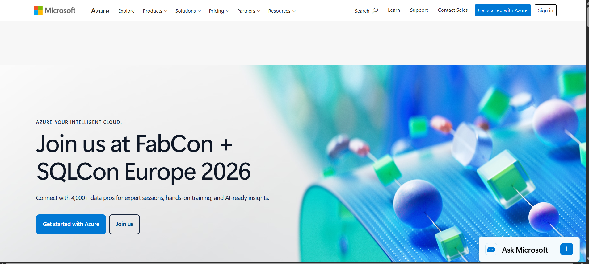

# Microsoft Azure Research

## Brief Overview

Microsoft Azure is a cloud computing platform developed by Microsoft. It provides services for computing, storage, databases, networking, security, artificial intelligence, analytics, and application development. Azure is widely used by organizations that already use Microsoft technologies.

## Global Infrastructure

Azure has a global infrastructure consisting of geographic regions, availability zones, and data centers. Its infrastructure allows organizations to deploy applications closer to their customers and improve availability and performance.

## Cloud Management Console

The Azure Portal is a web-based management interface used to create, configure, monitor, and manage Azure resources. Users can manage virtual machines, storage, databases, networking, identities, and many other services through the portal.

## Four Core Services

### 1. Azure Virtual Machines

Azure Virtual Machines provide virtual computers that can run Windows or Linux operating systems.

### 2. Azure Blob Storage

Azure Blob Storage is an object storage service used to store large amounts of unstructured data such as documents, images, videos, and backups.

### 3. Azure Virtual Network

Azure Virtual Network allows cloud resources to communicate securely through private networks.

### 4. Microsoft Entra ID

Microsoft Entra ID provides identity and access management for users, applications, and cloud resources.

## Three Advantages

1. **Microsoft integration** – Azure works closely with Microsoft products such as Windows Server and Microsoft 365.
2. **Enterprise support** – Azure provides services designed for large organizations and business applications.
3. **Hybrid cloud capabilities** – Azure supports connections between on-premises infrastructure and cloud resources.

## Typical Enterprise Use Cases

Azure is commonly used for Windows Server workloads, Microsoft 365 environments, enterprise applications, databases, hybrid cloud systems, virtual desktops, and business applications.

## Screenshot

