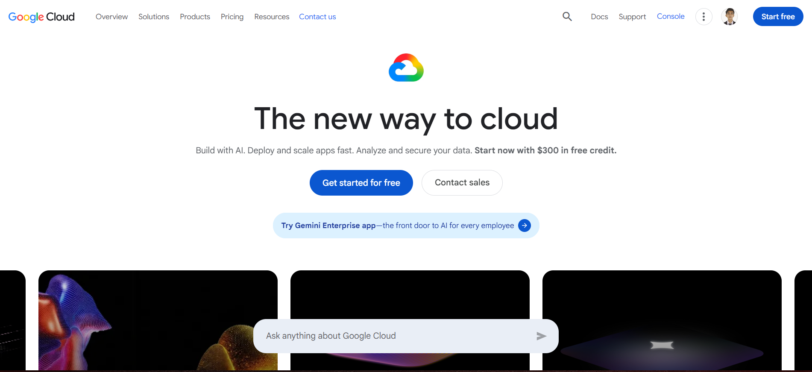

# Google Cloud Platform Research

## Brief Overview

Google Cloud Platform (GCP), commonly called Google Cloud, is a cloud computing platform developed by Google. It provides services for computing, storage, networking, databases, artificial intelligence, machine learning, analytics, and application development.

## Global Infrastructure

Google Cloud operates a global infrastructure consisting of regions and zones. This infrastructure allows organizations to deploy applications in different geographic locations and improve availability, performance, and scalability.

## Cloud Management Console

The Google Cloud Console is a web-based interface used to create, configure, monitor, and manage Google Cloud resources. It allows users to manage virtual machines, storage, networking, databases, Kubernetes clusters, and other services.

## Four Core Services

### 1. Compute Engine

Compute Engine provides virtual machines that can run Linux and Windows operating systems.

### 2. Cloud Storage

Cloud Storage is an object storage service used to store files, backups, images, videos, and other types of data.

### 3. Virtual Private Cloud

Google Cloud Virtual Private Cloud provides networking capabilities for cloud resources and allows organizations to create private networks.

### 4. Cloud IAM

Cloud Identity and Access Management controls access to Google Cloud resources and services.

## Three Advantages

1. **Artificial Intelligence and Machine Learning** – Google Cloud provides powerful AI and machine learning services.
2. **Kubernetes** – Google created Kubernetes and provides Google Kubernetes Engine for containerized applications.
3. **Data analytics** – Google Cloud provides powerful services for processing and analyzing large amounts of data.

## Typical Enterprise Use Cases

Google Cloud is commonly used for artificial intelligence, machine learning, data analytics, Kubernetes applications, web applications, software development, and large-scale data processing.

## Screenshot

